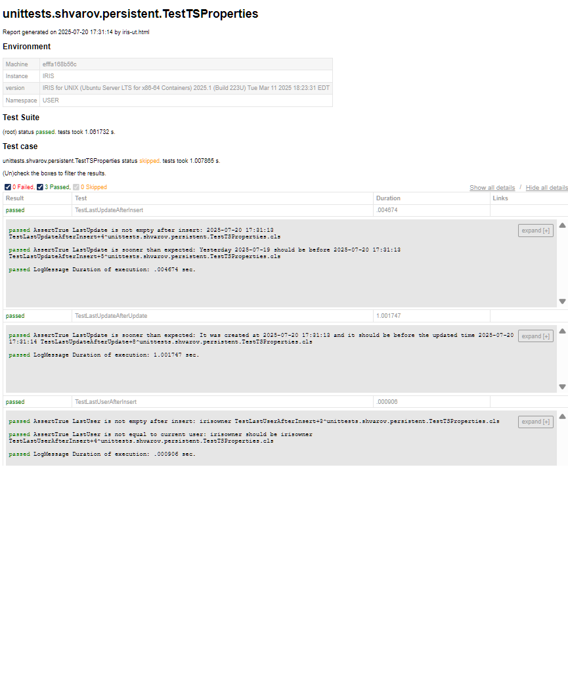

# iristest-html
HTML report viewer and generator.

Generate clean, interactive HTML reports from InterSystems IRIS %UnitTest results — save them as static files or view them directly in your browser.


---

## 🚀 Overview

`iristest-html` is a lightweight reporting tool that transforms raw IRIS `%UnitTest` output into a modern, readable HTML report — inspired by tools like `pytest-html`.

It helps developers, testers, and teams visualize test results, share test runs, and improve traceability in both development and CI/CD pipelines.

---

## 📸 Example



---

## 🔧 Features

- ✅ Generates HTML reports from IRIS `%UnitTest` results
- 📊 Summary of passed, failed, and skipped tests
- 🧭 Filterable and collapsible test views
- 📂 Static, portable reports (no server needed)
- ⚙️ Easy to integrate into DevOps pipelines

---

## 📦 Installation

You can install the utility as part of your IRIS project or package it as a ZPM module (coming soon).

For now, clone the repo or include the class in your environment:

```objectscript
; Load the class
Do $System.OBJ.Load("src/IrisTestHTML/Report.cls", "ck")

; Generate report
; file path is optional
; set the global ^UTReport("html") = filepath for defualt fetch
Do ##class(IrisTest.HTML.Report).Generate(UnitTestId,filePath)

